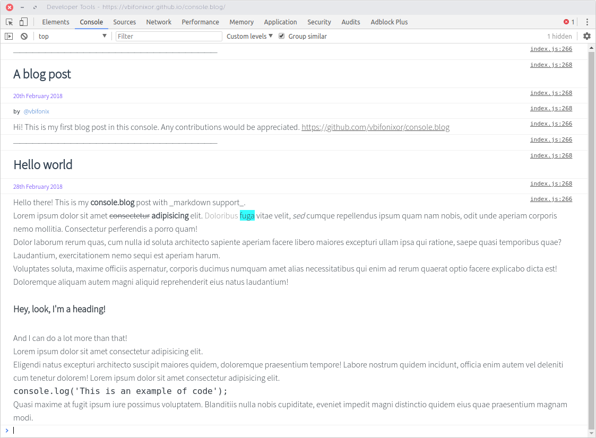

# console.blog

## Description
A simple console-based blog helper function for your cool frontend-developer's website. Uses **Markdown-like** syntax.
Author: Mikhail Kononenko (@vbifonixor)



## Usage
Download `index.js` file, connect it to your HTML, then write your posts with any way you like:
```javascript
console.blog(title, content, [date], [by]); // Your post title, content, date (optional) and name (optional too)
```

Examples you can find in index.html

## Dependencies
This function uses console.md, created by @WebReflection.
It is included into index.js (so I don't have to use any kind of bundler).
